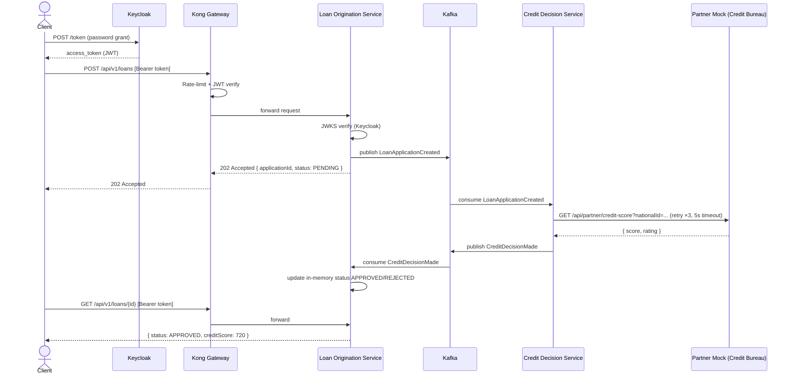
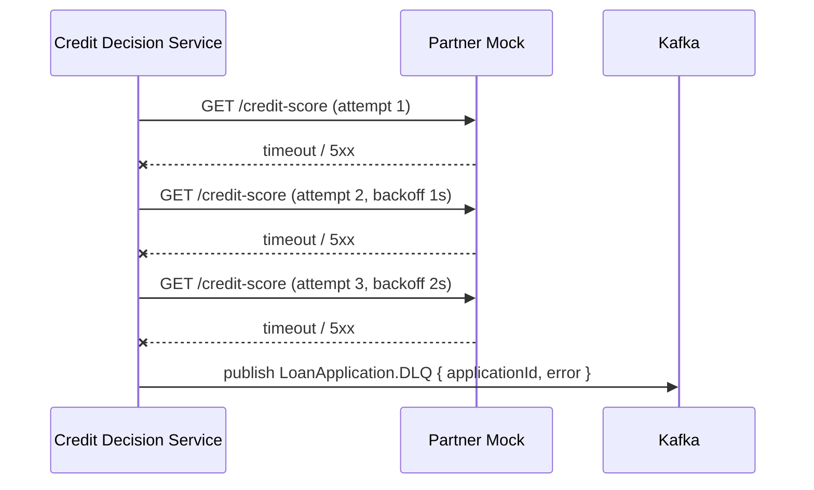

# Integration Design Pack — Financial Borrowing System

## 1. Business Workflow

A consumer submits a loan application. The system authenticates the request via Keycloak, enqueues the application on Kafka, and delegates credit scoring to an external Credit Bureau partner. The decision is returned asynchronously via a second Kafka event.



### Error path (partner failure)


---

## 2. EVNICT Partner Integration Table

| Field | Value |
|---|---|
| **E**vent / API | `GET /api/partner/credit-score` |
| **V**ersion | v1 (implicit, no versioning on partner) |
| **N**ame | Credit Bureau Score API |
| **I**nput | `?nationalId={string}` |
| **C**ontract | Response: `{ nationalId, score: int(300–850), rating: POOR\|FAIR\|GOOD\|EXCELLENT }` |
| **T**echnology | HTTP/REST over internal Docker network; synchronous; 5 s timeout; 3 retries with exponential backoff (1 s, 2 s, 4 s) |

| Field | Value |
|---|---|
| **E**vent / API | Kafka topic `LoanApplicationCreated` |
| **V**ersion | schema v1 |
| **N**ame | Loan Application Created Event |
| **I**nput | `{ applicationId, amount, term, nationalId, name, status: PENDING, createdAt }` |
| **C**ontract | Produced by Loan Origination Service; consumed by Credit Decision Service |
| **T**echnology | Apache Kafka; JSON payload; `credit-decision-group` consumer group |

| Field | Value |
|---|---|
| **E**vent / API | Kafka topic `CreditDecisionMade` |
| **V**ersion | schema v1 |
| **N**ame | Credit Decision Made Event |
| **I**nput | `{ applicationId, decision: APPROVED\|REJECTED, score, rating, timestamp }` |
| **C**ontract | Produced by Credit Decision Service; consumed by Loan Origination Service |
| **T**echnology | Apache Kafka; JSON payload; `loan-origination-group` consumer group |

| Field | Value |
|---|---|
| **E**vent / API | Kafka topic `LoanApplication.DLQ` |
| **V**ersion | schema v1 |
| **N**ame | Dead Letter Queue — failed credit decisions |
| **I**nput | `{ applicationId, originalTopic, error, timestamp }` |
| **C**ontract | Published when partner call fails after all retries |
| **T**echnology | Apache Kafka; manual consumer / ops tooling for replay |

---

## 3. Resilience Note

| Concern | Implementation |
|---|---|
| Partner call latency / timeout | `axios` timeout set to **5 000 ms** |
| Partner transient failures | **3 retries** with exponential backoff (1 s → 2 s → 4 s) |
| Partner permanent failure | Message routed to **`LoanApplication.DLQ`** topic for manual replay |
| Gateway overload | Kong **rate-limiting** plugin: 60 req/min per consumer |
| Duplicate loan events | Kafka `fromBeginning: true` + consumer group offsets prevent reprocessing after restart |
| Auth token expiry | Keycloak short-lived JWT; JWKS cached with `jwks-rsa` (10 req/min rate limit) |
| Service crash recovery | Docker Compose `depends_on`; K8s Deployment restartPolicy default `Always` |

**Known limitations (out of scope):**
- In-memory application store: data lost on restart; production would use a persistent store (PostgreSQL, Redis).
- No idempotency key on `POST /api/v1/loans`; duplicate submissions create duplicate records.
- No circuit breaker (e.g., `opossum`); DLQ is the failure boundary.

---

## 4. Runbook

### Start locally
```bash
docker-compose up --build -d
```
Wait ~30 s for Kafka and Keycloak to become ready.

### Obtain a token
```powershell
.\scripts\get-token.ps1 -Username john_doe -Password password123
```

### Submit a loan via Kong Gateway (port 8000)
```bash
curl -X POST http://localhost:8000/api/v1/loans \
  -H "Authorization: Bearer <TOKEN>" \
  -H "Content-Type: application/json" \
  -d '{"amount":5000,"term":12,"nationalId":"123456789","name":"John Doe"}'
```

### Check application status
```bash
curl http://localhost:8000/api/v1/loans/<applicationId> \
  -H "Authorization: Bearer <TOKEN>"
```

### Check DLQ messages (failed decisions)
```bash
# From inside the Kafka container
docker exec -it <kafka-container> \
  kafka-console-consumer.sh --bootstrap-server localhost:9092 \
  --topic LoanApplication.DLQ --from-beginning
```

### View logs in Kibana
1. Open `http://localhost:5601`
2. Stack Management → Index Patterns → create `docker-*`
3. Discover → filter by `source: docker.credit-decision-service`

### View metrics in Grafana
1. Open `http://localhost:3003` (admin / admin)
2. Add Prometheus data source: `http://prometheus:9090`
3. Import dashboard or use Explore → `up{job="loan-origination-service"}`

### Kubernetes deployment
```bash
kubectl apply -f k8s/kafka/kafka-zookeeper.yaml
kubectl apply -f k8s/infra/keycloak.yaml
kubectl apply -f k8s/infra/kong.yaml
kubectl apply -f k8s/infra/efk.yaml
kubectl apply -f k8s/apps/partner-mock.yaml
kubectl apply -f k8s/apps/loan-origination.yaml
kubectl apply -f k8s/apps/credit-decision.yaml
```

---

## 5. Architecture Review Checklist

| # | Item | Status |
|---|---|---|
| 1 | All external-facing APIs versioned (`/api/v1/`) | ✅ |
| 2 | Authentication enforced at API Gateway (Kong JWT plugin) and at service level (Keycloak JWKS) | ✅ |
| 3 | Sensitive operations (loan create, status read) require valid JWT; unauthenticated requests return 401 | ✅ |
| 4 | Partner integration uses async-first pattern (Kafka); sync HTTP call isolated to Credit Decision Service only | ✅ |
| 5 | Partner HTTP call has explicit timeout (5 s) to prevent thread exhaustion | ✅ |
| 6 | Partner failures are retried (×3, exponential backoff) before publishing to DLQ | ✅ |
| 7 | Dead Letter Queue (`LoanApplication.DLQ`) captures unprocessable messages for ops replay | ✅ |
| 8 | Rate limiting at gateway (60 req/min) protects downstream services from traffic spikes | ✅ |
| 9 | All services expose `/health` and `/metrics` (Prometheus-compatible) | ✅ |
| 10 | Centralized logging via EFK (Fluentd → Elasticsearch → Kibana); all containers use Fluentd log driver | ✅ |
| 11 | Identity provider (Keycloak) pre-seeded with realm, client, and test users via `realm-export.json` | ✅ |
| 12 | Kubernetes manifests cover all services, infra (Kafka, Keycloak, Kong, EFK) | ✅ |
| 13 | Kong declarative config (`KONG_DATABASE=off`) — no DB dependency, config-as-code | ✅ |
| 14 | In-memory store flagged as non-production; known limitation documented | ✅ |
| 15 | No secrets hardcoded in service code; configuration via environment variables | ✅ |
